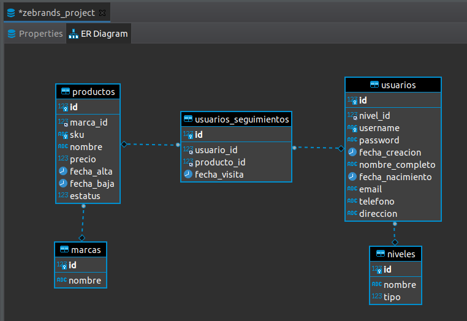
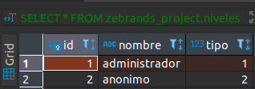

# Sistema de Catalogo para Administrar Productos

## Descripción
En este proyecto seremos capaces de gestionar usuarios y productos delimitando accesos con base al rol de cada usuario.

## Diagrama Entidad-Relación

## Tecnologias
- [FastAPI](https://fastapi.tiangolo.com/)
- [MySQL](https://www.mysql.com/)

## Deploy
- [DigitalOcean](https://zebrands.herokuapp.com/docs)
- [Heroku](https://zebrands.herokuapp.com/docs)

## Catalogos
Niveles de Usuarios

